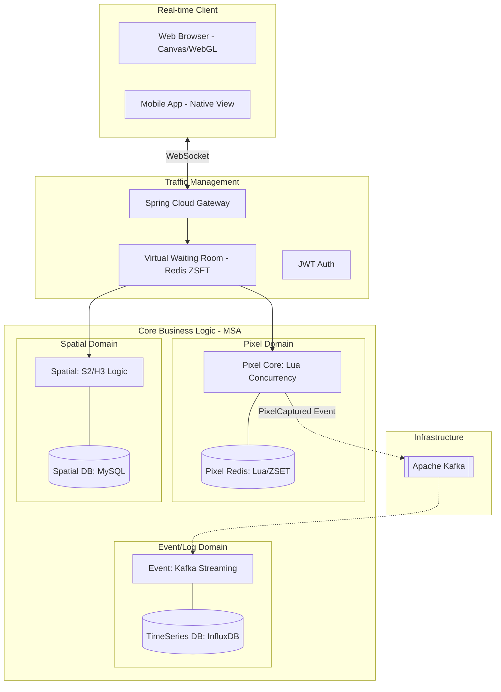

The Pixel War

수만 명의 사용자가 동시에 하나의 거대한 지도 기반 캔버스에 픽셀을 찍으며 영토를 점유하는 실시간 서비스입니다.
단순한 CRUD를 넘어 고빈도 쓰기 환경에서의 데이터 정합성 보장과 효율적인 공간 인덱싱 아키텍처 구축을 목표로 합니다.

클라이언트 레이어
- 수만 개의 마커를 DOM으로 생성할 때 발생하는 브라우저 과부하를 막기 위해 HTML5 Canvas 오버레이 및 WebGL(deck.gl) 기반 시각화 기법을 적용
- 실시간 위치 동기화를 위해 WebSocket을 사용

게이트웨이 및 트래픽 제어 레이어
- 선착순 점유 이벤트 시 발생하는 폭발적인 트래픽 스파이크로부터 시스템을 보호하기 위해 Redis ZSET 기반의 대기열 아키텍처를 구현
- 백엔드가 처리 가능한 용량만큼만 Token을 발급하여 안정적인 트랜잭션을 보장

비즈니스 로직 레이어 
- 동일 좌표에 대한 동시 요청을 해결하기 위해 Redis Lua Scripting을 도입하여 원자적 연산을 수행하고 성능을 극대화
- 복잡한 행정동 경계선을 Cell ID로 변환하여 픽셀의 지역 인증을 $O(1)$ 또는 $O(\log N)$ 시간 복잡도로 검증
- 육각형 그리드 시스템을 활용하여 인접 구역 간 등거리 검색 및 경로 최적화를 수행
- Apache Kafka를 통해 점유 이벤트를 비동기로 처리하며 배압 조절로 시스템 연쇄 장애를 방지

데이터 및 메시징 레이어
- 고빈도 위치 데이터는 Redis의 GEO 자료구조에 저장하여 디스크 I/O 병목을 제거
- 분산 환경에서 데이터 일관성을 위해 분산 락과 펜싱 토큰 기법을 병행하여 좀비 프로세스의 쓰기를 차단
