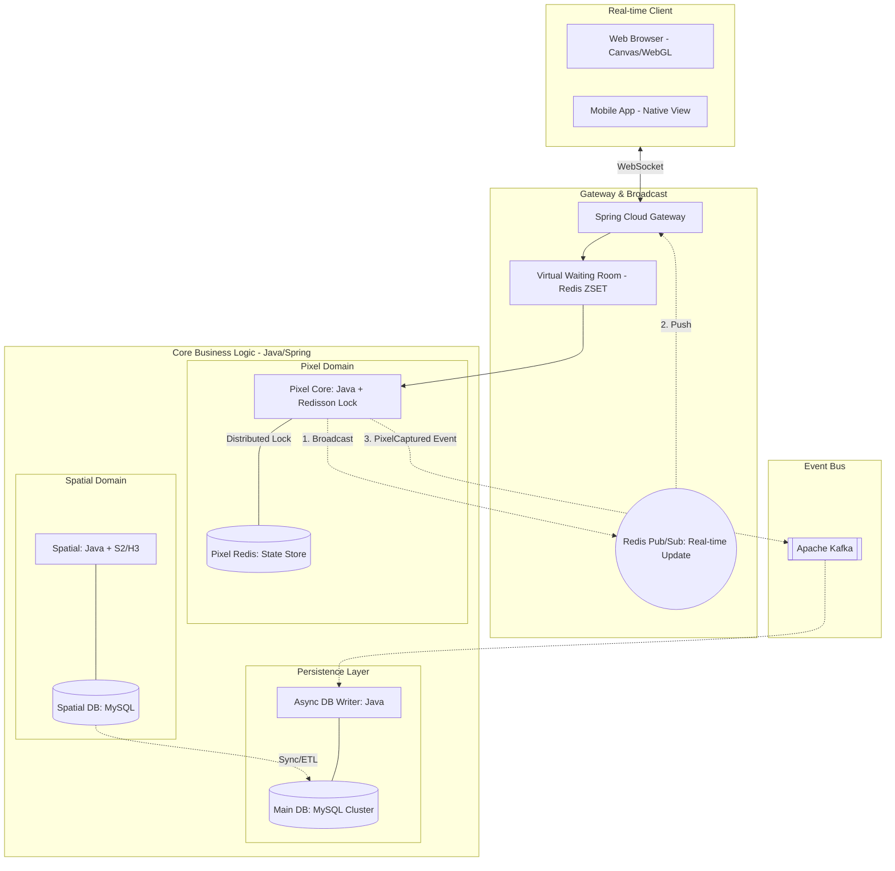

The Pixel War

수만 명의 사용자가 동시에 하나의 거대한 지도 기반 캔버스에 픽셀을 찍으며 영토를 점유하는 실시간 서비스입니다.
단순한 CRUD를 넘어 고빈도 쓰기 환경에서의 데이터 정합성 보장과 효율적인 공간 인덱싱 아키텍처 구축을 목표로 합니다.

1. Client Layer
- 수만 개의 마커를 DOM으로 생성할 때 발생하는 브라우저 과부하를 방지하기 위해 HTML5 Canvas 오버레이 및 WebGL(deck.gl) 기반 시각화 기법을 적용하여 렌더링 성능 최적화
- 사용자 간의 끊김 없는 상호작용을 위해 WebSocket을 통한 실시간 상태 동기화 아키텍처 구축

2. Traffic Management
- 선착순 점유 이벤트 시 발생하는 폭발적인 트래픽 스파이크로부터 시스템을 보호하기 위해 Redis ZSET 기반의 대기열 아키텍처 구현
- 백엔드 시스템이 수용 가능한 처리량(Throughput)만큼만 유효 토큰을 발급하여 서비스 전체의 가용성을 유지하고 안정적인 트랜잭션 보장

3. Business Logic
- 동일 좌표에 대한 동시 요청 충돌을 해결하기 위해 Redisson(Java) 분산 락 도입. 이를 통해 분산 환경에서도 원자적 연산을 보장하며 Race Condition을 원천 차단
- 복잡한 행정동 경계선을 Google S2 / Uber H3 Cell ID로 변환하여 픽셀의 지역 인증을 $O(1)$ 또는 $O(\log N)$ 의 시간 복잡도로 정밀하게 검증
- 육각형 그리드 시스템을 활용하여 인접 구역 간 등거리 검색 및 경로 최적화 연산의 효율성 극대화
- Apache Kafka를 통해 점유 이벤트를 비동기로 처리하며 Consumer 그룹의 배압(Backpressure) 조절을 통해 급격한 부하 상승 시에도 시스템 연쇄 장애(Cascading Failure)를 방지

4. Data & Messaging
- 고빈도 위치 데이터 및 상태 정보는 Redis GEO 자료구조에 저장하여 디스크 I/O 병목을 제거하고 검색 속도를 향상
- 분산 환경에서 데이터 일관성을 위해 분산 락과 펜싱 토큰(Fencing Token) 기법을 병행하여 네트워크 지연으로 인한 좀비 프로세스의 잘못된 쓰기 작업을 물리적으로 차단
