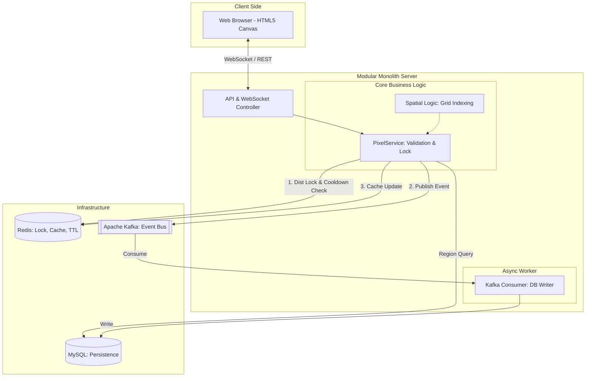

## The Pixel War

수만 명의 사용자가 거대한 지도 기반 캔버스에 동시에 픽셀을 찍으며 영토를 점유하는 실시간 땅따먹기 게임(협업픽셀아트)입니다.
초기 단계에서는 개발 생산성과 배포 편의성을 위해 모듈러 모놀리스(Modular Monolith) 아키텍처로 설계되었으며
Redis 분산 락과 Kafka 비동기 처리를 도입하여 단일 서버 환경에서도 데이터 정합성과 고성능을 보장합니다.

---

## 시스템 아키텍처 다이어그램

```mermaid
graph TD
    %% Client Layer
    subgraph ClientLayer [Client Side]
        Browser[Web Browser - HTML5 Canvas]
    end

    %% Application Layer
    subgraph Server [Modular Monolith Server]
        direction TB
        Controller[API & WebSocket Controller]
        
        subgraph Logic [Core Business Logic]
            PixelSvc[PixelService: Validation & Lock]
            SpatialEngine[Spatial Logic: Grid Indexing]
        end
        
        subgraph Consumer [Async Worker]
            PixelConsumer[Kafka Consumer: DB Writer]
        end
    end

    %% Infrastructure
    subgraph Infra [Infrastructure]
        Redis[(Redis: Lock, Cache, TTL)]
        Kafka[[Apache Kafka: Event Bus]]
        DB[(MySQL: Persistence)]
    end

    %% Flow
    Browser <--> |WebSocket / REST| Controller
    Controller --> PixelSvc
    
    %% Write Path
    PixelSvc -- 1. Dist Lock & Cooldown Check --> Redis
    PixelSvc -- 2. Publish Event --> Kafka
    PixelSvc -- 3. Cache Update --> Redis
    
    %% Read/Spatial Path
    PixelSvc -- Region Query --> DB
    SpatialEngine -.-> PixelSvc

    %% Async Persistence
    Kafka -- Consume --> PixelConsumer
    PixelConsumer -- Write --> DB
```

1. Client Layer: Rendering OptimizationHTML5 Canvas & Optimistic UI

수많은 픽셀 데이터를 DOM 요소로 생성하는 대신 Canvas API를 사용하여 렌더링 부하를 최소화했습니다.
서버 응답을 기다리지 않고 즉시 화면에 반영하는 Optimistic UI(낙관적 업데이트) 패턴을 적용하고, 실패 시 롤백(Rollback)하는 로직을 통해 사용자 경험을 극대화했습니다.
Region-based Loading: 지도의 줌 레벨과 보고 있는 영역(Viewport)에 맞춰 필요한 픽셀 데이터만 쿼리하여 네트워크 리소스를 최적화했습니다.

2. Concurrency Control (동시성 제어)Redisson Distributed Lock

동일한 좌표에 여러 사용자가 동시에 픽셀을 찍을 경우 발생하는 Race Condition을 방지하기 위해 **Redis 분산 락(Redisson)**을 도입했습니다. 이를 통해 DB 락에 의존하지 않고도 데이터 무결성을 보장합니다.
Redis TTL (Cooldown System): 유저별 쿨타임(n초) 관리 로직을 DB가 아닌 Redis의 TTL(Time To Live) 기능을 활용해 구현하여, 잦은 조회로 인한 DB 부하를 원천 차단했습니다.

3. Event-Driven Persistence (비동기 영속성)Apache Kafka

픽셀 점유 요청과 DB 저장 로직을 분리했습니다. PixelService는 Kafka에 이벤트를 발행하고 즉시 응답하며, 별도의 PixelConsumer가 비동기로 DB에 데이터를 저장합니다.
Traffic Buffering: 갑작스러운 트래픽 스파이크가 발생해도 Kafka가 버퍼 역할을 수행하여 DB가 다운되는 것을 방지합니다.

4. Spatial Indexing (공간 인덱싱)Grid System

위도/경도 좌표를 정밀한 격자(Grid) 시스템으로 변환하여 관리합니다. 복잡한 공간 쿼리 없이 정수형 인덱스(x, y)만으로 특정 영역의 픽셀을 $O(1)$ 수준으로 빠르게 조회합니다.

---

## Tech Stack
- Backend: Java 17, Spring Boot 3.2.1
- Database: MySQL, H2 (Test)
- Cache & Lock: Redis (Redisson)
- Message Broker: Apache Kafka
- Frontend: HTML5 Canvas, Naver Maps API, WebSocket (SockJS/Stomp)
