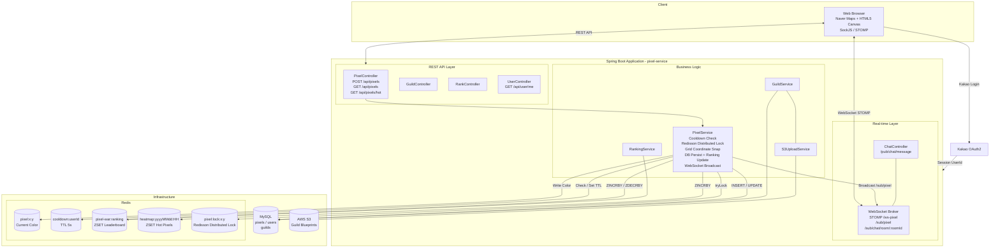

# The Pixel War

수만 명의 사용자가 동시에 하나의 거대한 지도 기반 캔버스에 픽셀을 찍으며 영토를 점유하는 실시간 서비스입니다.
단순한 CRUD를 넘어 고빈도 쓰기 환경에서의 데이터 정합성 보장과 효율적인 공간 인덱싱 아키텍처 구축을 목표로 합니다.

```mermaid
graph TD
    %% Client Layer
    subgraph ClientLayer [Client]
        Web[Web Browser\nNaver Maps + HTML5 Canvas\nSockJS / STOMP]
    end

    %% Spring Boot Monolith
    subgraph AppServer [Spring Boot Application - pixel-service]
        direction TB

        subgraph APILayer [REST API Layer]
            PixelCtrl[PixelController\nPOST /api/pixels\nGET /api/pixels\nGET /api/pixels/hot]
            GuildCtrl[GuildController]
            RankCtrl[RankController]
            UserCtrl[UserController\nGET /api/user/me]
        end

        subgraph BusinessLogic [Business Logic]
            PixelSvc[PixelService\nCooldown Check\nRedisson Distributed Lock\nGrid Coordinate Snap\nDB Persist + Ranking Update\nWebSocket Broadcast]
            GuildSvc[GuildService]
            RankSvc[RankingService]
            S3Svc[S3UploadService]
        end

        subgraph RealtimeLayer [Real-time Layer]
            WSBroker[WebSocket Broker\nSTOMP /ws-pixel\n/sub/pixel\n/sub/chat/room/:roomId]
            ChatCtrl[ChatController\n/pub/chat/message]
        end
    end

    %% Infrastructure
    subgraph Infrastructure [Infrastructure]
        subgraph RedisStore [Redis]
            RedisPixel[(pixel:x:y\nCurrent Color)]
            RedisCooldown[(cooldown:userId\nTTL 5s)]
            RedisRank[(pixel-war:ranking\nZSET Leaderboard)]
            RedisHeatmap[(heatmap:yyyyMMdd:HH\nZSET Hot Pixels)]
            RedisLock[(pixel:lock:x:y\nRedisson Distributed Lock)]
        end

        MySQL[(MySQL\npixels / users\nguilds)]

        S3[(AWS S3\nGuild Blueprints)]
    end

    %% Auth
    OAuth2[Kakao OAuth2]

    %% Relationships
    Web <-->|REST API| APILayer
    Web <-->|WebSocket STOMP| WSBroker

    PixelCtrl --> PixelSvc

    PixelSvc -->|Check / Set TTL| RedisCooldown
    PixelSvc -->|tryLock| RedisLock
    PixelSvc -->|Write Color| RedisPixel
    PixelSvc -->|ZINCRBY| RedisHeatmap
    PixelSvc -->|ZINCRBY / ZDECRBY| RedisRank
    PixelSvc -->|INSERT / UPDATE| MySQL
    PixelSvc -->|Broadcast /sub/pixel| WSBroker

    GuildSvc --- MySQL
    GuildSvc --- S3Svc
    S3Svc --- S3
    RankSvc --- RedisRank
    ChatCtrl --- WSBroker

    Web -->|Kakao Login| OAuth2
    OAuth2 -->|Session UserId| AppServer
```

## 1. Client Layer
- Naver Maps 위에 HTML5 Canvas 오버레이를 적용하여 수만 개의 픽셀을 DOM 없이 렌더링, 브라우저 과부하 방지
- SockJS / STOMP 기반 WebSocket으로 픽셀 업데이트 및 채팅 메시지를 실시간으로 동기화

## 2. Concurrency Control
- 동일 좌표에 대한 동시 요청 충돌을 해결하기 위해 Redisson 분산 락(`pixel:lock:x:y`) 도입
- 락 대기 5초, 유지 2초로 임계 구간을 보호하여 Race Condition 원천 차단
- Redis TTL 기반 5초 쿨타임(`cooldown:userId`)으로 단일 사용자의 과도한 쓰기 요청 차단

## 3. Business Logic
- 픽셀 업데이트 시 좌표를 GRID_SIZE(0.0003도) 단위 직각 그리드로 스냅하여 동일 셀에 대한 요청을 하나의 키로 수렴
- PixelService가 락 획득 후 Redis 색상 캐시 쓰기 → 히트맵 ZSET 갱신 → MySQL 영속화 → 순위 점수 증감 → WebSocket 브로드캐스트를 단일 트랜잭션 흐름으로 동기 처리
- 길드 기능: 생성/가입/탈퇴, 길드장 권한 관리, 청사진(Blueprint) 이미지 AWS S3 업로드

## 4. Data Layer
- **Redis String** (`pixel:x:y`): 최신 픽셀 색상 캐시, 디스크 I/O 없이 O(1) 조회
- **Redis ZSET** (`pixel-war:ranking`): 사용자별 점수 순위, ZINCRBY/ZREVRANGE로 Top 10 실시간 갱신
- **Redis ZSET** (`heatmap:yyyyMMdd:HH`): 시간 단위 핫픽셀 집계, TTL 2시간으로 자동 만료
- **MySQL**: pixels / users / guilds 영속 저장, `idx_pixel_coords(x, y)` 복합 유니크 인덱스로 중복 방지
- **AWS S3**: 길드 청사진 이미지 저장 (`blueprints/{UUID}.{ext}`)
