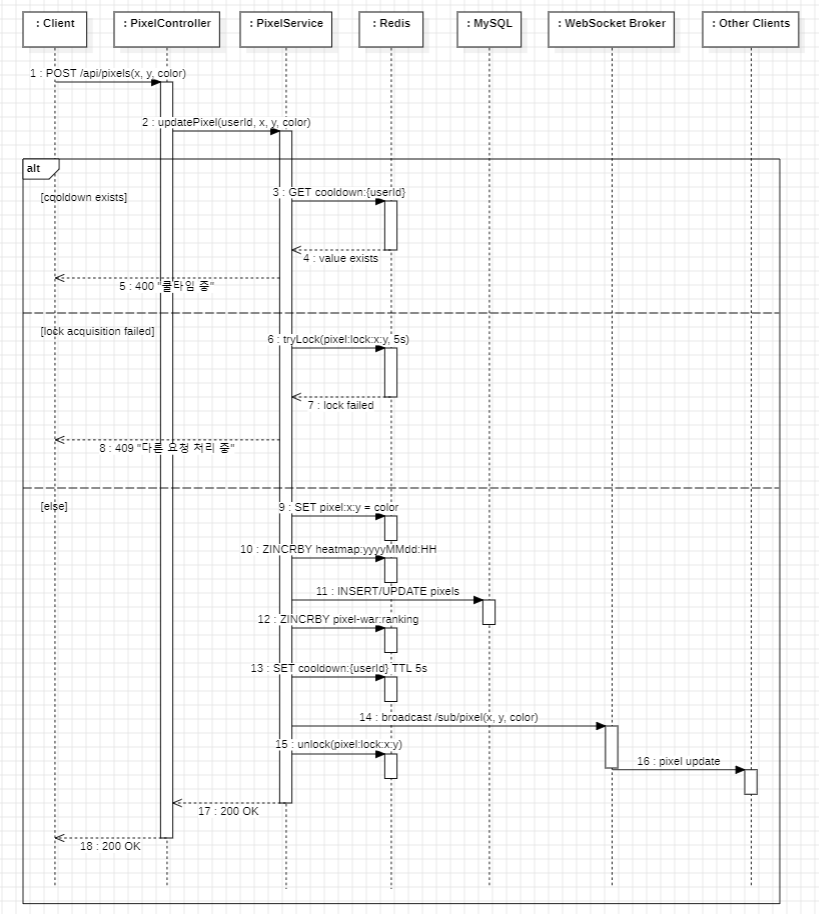
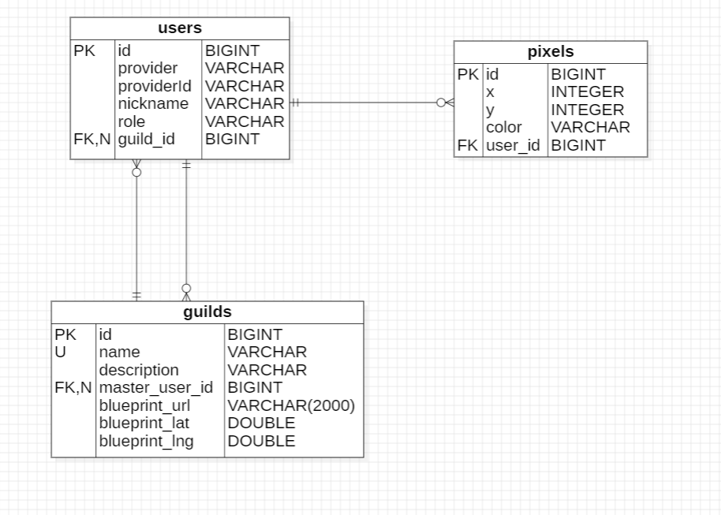

# The Pixel War


지도 위 수많은 사용자가 좌표를 동시에 픽셀을 찍는 환경(픽셀 아트 & 영토 전쟁)에서, **동시 쓰기 충돌을 어떻게 막고 실시간으로 모든 사용자에게 일관된 상태를 전파할 것인가**를 고민한 프로젝트입니다.

단순 CRUD가 아니라 **동시성 제어, 캐시 계층 설계, 실시간 브로드캐스팅** 세 축의 상호작용에 초점을 맞췄습니다.

---

## 시연

<p align="center">
  <a href="https://youtu.be/KGTUfennwBE">
    
  </a>
</p>

> 두 브라우저(Chrome / Edge)를 나란히 띄워, 한쪽에서 픽셀을 찍었을 때 다른 쪽에 즉시 반영되는 WebSocket 동기화와, 쿨다운 동작을 확인할 수 있습니다.

---

## 핵심 기술 과제

| # | 문제 | 접근 | 결과 |
|---|------|------|------|
| 1 | 동일 좌표에 동시 쓰기 요청이 몰리면 마지막 요청만 반영되는 Race Condition 발생 | Redis TTL 기반 쿨다운 + Redisson 분산 락의 이중 방어 구조 설계 | 좌표 단위로 임계 구간 보호, 동시 충돌 시에도 직렬화된 처리 보장 |
| 2 | 픽셀 1건 갱신마다 DB I/O 발생 시 고빈도 쓰기 환경에서 병목 발생 | Redis String을 1차 캐시로 두고 DB 영속화는 동기 흐름 내 단일 트랜잭션으로 처리 | 조회 시 디스크 I/O 제거 (O(1) 조회) |
| 3 | 실시간 순위 / 핫픽셀 집계를 매번 SQL 집계로 계산하면 응답 지연 발생 | Redis ZSET (`ZINCRBY` / `ZREVRANGE`) 으로 순위 갱신을 O(log N)에 처리 | Top N 조회 상수 시간, TTL로 자동 만료 |
| 4 | 외부 코드 리뷰에서 다수 보안 취약점 식별 | 우선순위 분류 후 단계적 리메디에이션 (시크릿 분리, 인증 우회, XSS) | 아래 [보안 개선 이력](#보안-개선-이력) 참고 |

---

## 아키텍처


---

## 동시성 제어 — 가장 깊이 고민한 부분

같은 좌표에 여러 사용자가 동시에 픽셀을 찍는 시나리오에서, 단순 DB 트랜잭션만으로는 다음 문제를 해결할 수 없었습니다.

- 여러 인스턴스로 확장될 경우 JVM 단위의 `synchronized` 는 무력화됨
- DB Row Lock은 좌표 단위 락이지만, **락 획득 전에 발생하는 Redis 캐시 갱신과의 순서가 보장되지 않음**
- 단일 사용자가 짧은 시간 내 반복 요청을 보내는 어뷰징 시나리오도 함께 막아야 함

### 해결 — 이중 방어 구조

**1차: Redis TTL 기반 쿨다운 (`cooldown:userId`, TTL 5s)**
사용자 단위로 5초간 새 요청을 차단. 락 진입 자체를 줄여 락 경합을 완화하는 1차 필터.
인증 컨텍스트에서 추출한 `userId` 를 키로 사용하므로 클라이언트 측 우회 불가.

**2차: Redisson 분산 락 (`pixel:lock:x:y`, wait 5s / lease 2s)**
좌표 단위로 분산 락을 걸어, 인스턴스가 여러 개여도 동일 좌표에 대한 쓰기는 직렬화.
lease 시간을 명시적으로 설정해 락 보유 인스턴스가 죽어도 일정 시간 후 자동 해제되도록 함.

### 시퀀스 다이어그램



> 쿨다운 차단(`alt [cooldown exists]`) / 락 획득 실패(`alt [lock acquisition failed]`) / 정상 흐름(`else`) 세 가지 분기를 명시적으로 처리합니다.

### 좌표 스냅

좌표를 `GRID_SIZE = 0.0003도` 단위로 스냅하여 인접한 미세 좌표 요청이 같은 셀로 수렴되도록 처리, 락 키 공간을 유한하게 유지했습니다.

---

## 데이터 모델



| 테이블 | 역할 | 특이사항 |
|--------|------|---------|
| `users` | 사용자 정보 (OAuth Provider 기준) | `provider` + `providerId` 조합으로 외부 OAuth 식별, `guild_id` 는 nullable |
| `pixels` | 픽셀 영속화 | `(x, y, user_id)` 조합으로 누가 어디 찍었는지 추적 |
| `guilds` | 길드 / 청사진 정보 | `blueprint_url` 은 S3 객체 URL, `blueprint_lat/lng` 로 지도상 위치 지정 |

실시간 갱신은 Redis에서 처리되고, MySQL은 정합성 확보를 위한 영속 계층으로만 사용합니다.

---

## 보안 개선 이력

외부 코드 리뷰를 통해 식별된 보안 취약점을 우선순위에 따라 단계적으로 리메디에이션했습니다.
**신입 단계에서 흔히 간과되는 영역을 직접 식별하고 수정한 경험**입니다.

| 분류 | 발견된 문제 | 해결 방법 |
|------|------------|----------|
| 시크릿 관리 | `application.yml` 에 DB / OAuth / AWS 키 하드코딩, Git 이력에 노출 | 환경별 설정 파일 분리 (`application-local.yml`, gitignore 처리), 노출된 AWS 액세스 키 즉시 로테이션 |
| 인증 우회 | 클라이언트가 전달한 `userId` 를 그대로 신뢰하여 위변조 가능 | Spring Security 컨텍스트의 인증 주체에서 `userId` 추출하도록 변경 |
| XSS | 채팅 메시지를 `innerHTML` 로 렌더링하여 스크립트 주입 가능 | `textContent` 사용 및 입력 검증 추가 |

---

## 트러블슈팅 기록

> 개발 및 운영 과정에서 마주한 문제와 원인 분석, 해결 과정을 기록합니다.

### 1. 제목

**증상**

**원인**

**해결**

---

### 2. 제목

**증상**

**원인**

**해결**

---

## 성능 측정 (예정)

k6 기반 부하 테스트를 통해 동시성 제어 효과를 정량적으로 검증할 예정입니다.

- **시나리오**: 동일 좌표 집중 요청, 다중 사용자 분산 요청
- **측정 지표**: p95 / p99 응답 시간, RPS, 에러율, 데이터 정합성 (최종 색상 일치 여부)
- **비교 대상**: Redisson 락 적용 전후

---

## 기술 스택

| 레이어 | 기술 |
|--------|------|
| Client | HTML / CSS / JavaScript, Naver Maps API, HTML5 Canvas, SockJS, STOMP.js |
| Backend | Java 17, Spring Boot 3.x, Spring Security, Spring Data JPA |
| Real-time | Spring WebSocket, STOMP |
| Cache / Coordination | Redis, Redisson (분산 락) |
| Database | MySQL 8.0 |
| Storage | AWS S3 (길드 청사진 이미지) |
| Auth | Kakao OAuth 2.0 |
| Build | Gradle |

---

## 시작하기

### 사전 준비
- Java 17+
- MySQL 8.0+
- Redis 7.0+
- Kakao Developers 앱 키, AWS S3 버킷, Naver Maps API 키

### 환경 변수 설정

```bash
# application-local.yml 또는 환경 변수
DB_URL=jdbc:mysql://localhost:3306/pixelwar
DB_USERNAME=...
DB_PASSWORD=...
REDIS_HOST=localhost
REDIS_PORT=6379
KAKAO_CLIENT_ID=...
KAKAO_CLIENT_SECRET=...
AWS_ACCESS_KEY=...
AWS_SECRET_KEY=...
AWS_S3_BUCKET=...
NAVER_MAPS_CLIENT_ID=...
```

### 실행

```bash
./gradlew bootRun
# 브라우저에서 http://localhost:8080 접속
```

---

## 작성자

**이강희**
계명대학교 컴퓨터공학과
[GitHub](https://github.com/dlrkdgml0716)